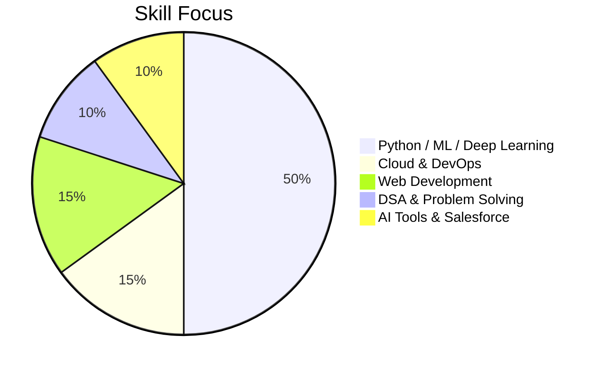

# 👋 Hi, I'm KRISHNAPRASATH  
### AI Engineer • Data Scientist • ML & Deep Learning Enthusiast

I build scalable Machine Learning, Deep Learning, Generative AI and Cloud-ready applications.  
Strong in **Python**, capable in **Java**, and always exploring new technologies.

---

  

  

  
  
  

---

## 🚀 About Me
- Passionate about **AI, ML, Deep Learning, Cloud & Automation**
- Currently exploring **Agentic AI, GenAI, Cloud Engineering, and DSA**
- I love building clean, scalable, production-oriented solutions  
---

# 🧠 Skills & Expertise 

## 🔥 AI • ML • Deep Learning

  
  
  
  

---

## 🤖 Agentic AI / GenAI Tools

  
  
  
  

---

## ☁️ Cloud & Deployment

  

---

## 🌐 Web Development
### Frontend

  

### Backend

  

---

## 💻 Programming Languages

  

---

## 🧠 CS Fundamentals

  
  
  

---

## 🛠 Tools & Platforms

  
  
  

---

## 📈 Skills Snapshot

---

# 🛠️ Projects

### 🧬 **ReSuzo – AI Resume Builder & Job Matcher (GenAI + ML)**
- Automated resume formatting & enhancement  
- ATS score prediction  
- Resume–Job matching using ML similarity scoring  
- GenAI-powered smart recommendations  

---

### 🔍 **ML Classification Benchmark**
A unified pipeline comparing multiple ML models.

### ❤️ **Heart Attack Prediction**
Predictive analytics with feature engineering & interpretation.

### 🏦 **Bank & Employee Management Systems**
Backend APIs with Node.js & SQL architecture.

### 🤖 **Agentic AI Experiments**
Autonomous workflows & automation using agent-based systems.

---

## 🌟 Strengths
- Strong Python + ML foundations  
- Fast learner, highly adaptable  
- Excellent debugging and problem-solving  
- Loves building production-ready, clean systems  

---

## 🌐 Connect With Me

  
  
  

