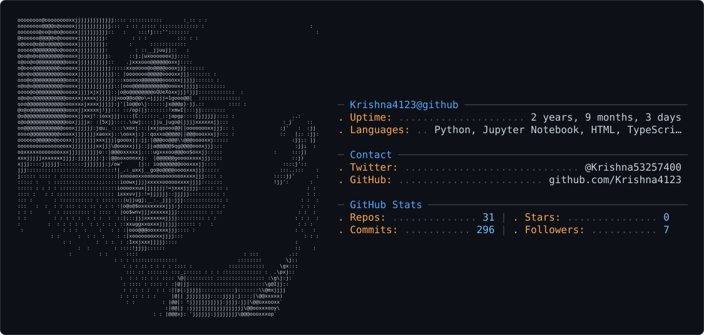

<p align="center">
  
</p>

<p align="center">
  
</p>

<p align="center">
  
</p>

<div align="center">
  
  
  
</div>

<p align="center">
  
</p>

<p align="center">
  
</p>

```bash
╔══════════════════════════════════════════════════════════════════════╗
║  krishnaprasath@github:~$  ./profile.sh                             ║
╠══════════════════════════════════════════════════════════════════════╣
║                                                                      ║
║   UID      →  Krishna4123                                            ║
║   ROLE     →  AI Engineer  |  ML Enthusiast  |  Cloud Architect      ║
║   STATUS   →  [ ONLINE ]  ████████████████████  100%                ║
║                                                                      ║
║   $ cat about.log                                                    ║
║   [INFO]  Passionate about AI, ML, Deep Learning & Automation        ║
║   [INFO]  Currently exploring Agentic AI, GenAI & Cloud Engineering  ║
║   [INFO]  Building clean, scalable, production-ready AI systems      ║
║                                                                      ║
║   $ uptime                                                           ║
║   [ 2+ years deploying AI to production ]                            ║
║                                                                      ║
╚══════════════════════════════════════════════════════════════════════╝
```

<p align="center">
  
</p>

<div align="center">

<!-- Row 1: AI / ML Core -->


<!-- Row 2: Cloud / DevOps -->


<!-- Row 3: Engineering -->


</div>

<p align="center">
  
</p>

## 📊 GitHub Stats & Trophies


<p align="center">
  
  
</p>

<p align="center">
  
</p>

<p align="center">
  
</p>

<p align="center">
  
</p>

<p align="center">
  
</p>


<div align="center">

<!-- LANGUAGES -->
<kbd>◈ &nbsp; L A N G U A G E S &nbsp; ◈</kbd>

<br/><br/>

[](https://skillicons.dev)

<br/>

<!-- FRONTEND -->
<kbd>◈ &nbsp; F R O N T E N D &nbsp; ◈</kbd>

<br/><br/>

[](https://skillicons.dev)

<br/>

<!-- BACKEND -->
<kbd>◈ &nbsp; B A C K E N D &nbsp; ◈</kbd>

<br/><br/>

[](https://skillicons.dev)

<br/>

<!-- DATABASE -->
<kbd>◈ &nbsp; D A T A B A S E S &nbsp; ◈</kbd>

<br/><br/>

[](https://skillicons.dev)

<br/>

<!-- DEVOPS / CLOUD -->
<kbd>◈ &nbsp; D E V O P S &nbsp; / &nbsp; C L O U D &nbsp; ◈</kbd>

<br/><br/>

[](https://skillicons.dev)

<br/>

<!-- TOOLS -->
<kbd>◈ &nbsp; T O O L S &nbsp; ◈</kbd>

<br/><br/>

[](https://skillicons.dev)

</div>

<p align="center">
  
</p>

<!-- SPACE SHOOTER CONTRIBUTION GRAPH -->
<p align="center">
  
</p>

## 🔗 Connect with Me

<p align="center">
  <a href="https://www.linkedin.com/in/krishnaprasath-s-k-7800a8273/">
    
  </a>&nbsp;
  <a href="https://x.com/Krishna53257400">
    
  </a>&nbsp;
  <a href="https://wa.me/916383084896">
    
  </a>&nbsp;
  <a href="mailto:krishnaprasath42213@gmail.com">
    
  </a>&nbsp;
  <a href="https://noir-motion-studio.vercel.app/">
    
  </a>
</p>

<p align="center">
  <a href="https://www.buymeacoffee.com/krishna4422" target="_blank">
    
  </a>
</p>


