# 👋 Hi, I'm KRISHNAPRASATH  
### AI Engineer • Data Scientist • ML & Deep Learning Enthusiast

I build scalable Machine Learning, Deep Learning, and Cloud-ready applications.  
Highly adaptable — strong in **Python**, capable in **Java**, and quick to learn any new technology or environment.

---

## 🚀 About Me
- Passionate about **AI, ML, Deep Learning, Cloud & Automation**  
- Strong analytical mindset with hands-on experience in real-world ML projects  
- Currently exploring **Agentic AI, GenAI, Cloud Engineering, and DSA**  
- Believe in writing clean, scalable, production-oriented code  

---

## 🧭 Mind Map — My Expertise & Work Areas

```mermaid
mindmap
  root((KRISHNAPRASATH))

    %% Left Side Nodes
    AI((AI • ML • DL))
      ML((Machine Learning))
        Supervised((Supervised))
        Unsupervised((Unsupervised))
        Metrics((Metrics))
      DL((Deep Learning))
        ANN((ANN))
        CNN((CNN))
        RNN((RNN))
        Transfer((Transfer Learning))
      GenAI((Generative AI))
        LLMs((LLMs))
        RAG((RAG))
        Prompting((Prompt Engineering))
        FineTune((Fine Tuning))
      Agentic((Agentic AI))
        Workflow((Workflows))
        Tools((Tool Use))
        Automation((Automation))
      ResumeAI((ReSuzo Resume AI))
        ATS((ATS Optimizer))
        Match((Job Matcher))
        Enhance((Resume Enhancer))

    %% Right Side Nodes
    Cloud((Cloud & Deployment))
      AWS((AWS))
      GCP((GCP))
      FastAPI((FastAPI Deployment))
      Docker((Docker))
    
    WebDev((Web Development))
      Frontend((Frontend))
        React((React.js))
        Nextjs((Next.js))
      Backend((Backend))
        Node((Node.js))
        Express((Express.js))
        SQL((SQL))
        MongoDB((MongoDB))
        Postgres((PostgreSQL))

    Programming((Programming Skills))
      Python((Python Advanced))
      Java((Java))
      JS((JavaScript))
      CPP((C / C++))

    CSFund((CS Fundamentals))
      DSA((DSA))
      ProblemSolving((Problem Solving))
      SysDesign((System Design))

    Tools((Tools & Platforms))
      Git((Git & GitHub))
      Postman((Postman))
      Salesforce((Salesforce))
      AITools((AI Tools))

```

---

## 🛠️ Projects

### 🧬 **ReSuzo – AI Resume Builder & Job Matcher (GenAI + ML)**
A smart resume enhancement system powered by **Generative AI + Machine Learning**.  
Features:  
- Automated resume building & formatting  
- ATS score prediction  
- Resume enhancement using GenAI  
- Job–Resume matching using ML similarity scoring  
- Smart recommendations to improve job selection chances  

---
### 🔍 **ML Classification Benchmark**
Comparing multiple ML models in a unified Colab pipeline.

### ❤️ **Heart Attack Prediction**
Predictive analytics with feature engineering & model interpretation.

### 🏦 **Bank & Employee Management Systems**
CRUD + REST API using Node.js, SQL, and clean backend architecture.

### 🤖 **Agentic AI Experiments**
Building autonomous AI workflows and automation pipelines.
---

## 📈 Skills Snapshot

---
## 💼 Strengths

- Strong Python foundation with hands-on AI/ML/DL work  
- Adaptable to every situation & fast learner  
- Excellent debugging and problem-solving skills  
- Focused on clean, scalable, production-ready code  
- Deep interest in innovation & building impactful AI systems  

---

## 🌐 Connect With Me

- **Instagram:** https://www.instagram.com/04_krishna_0405  
- **LinkedIn:** https://www.linkedin.com/in/krishnaprasath-s-k-7800a8273
- **Twitter:** https://x.com/Krishna53257400  

